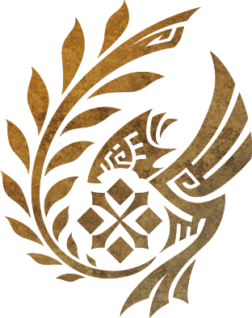
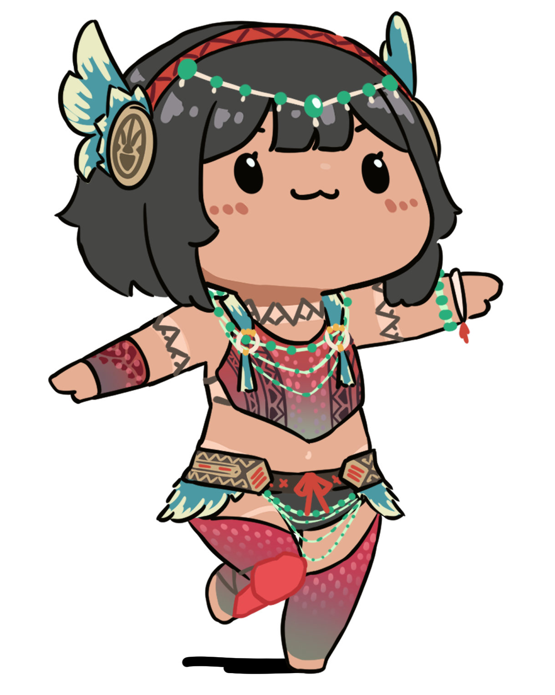
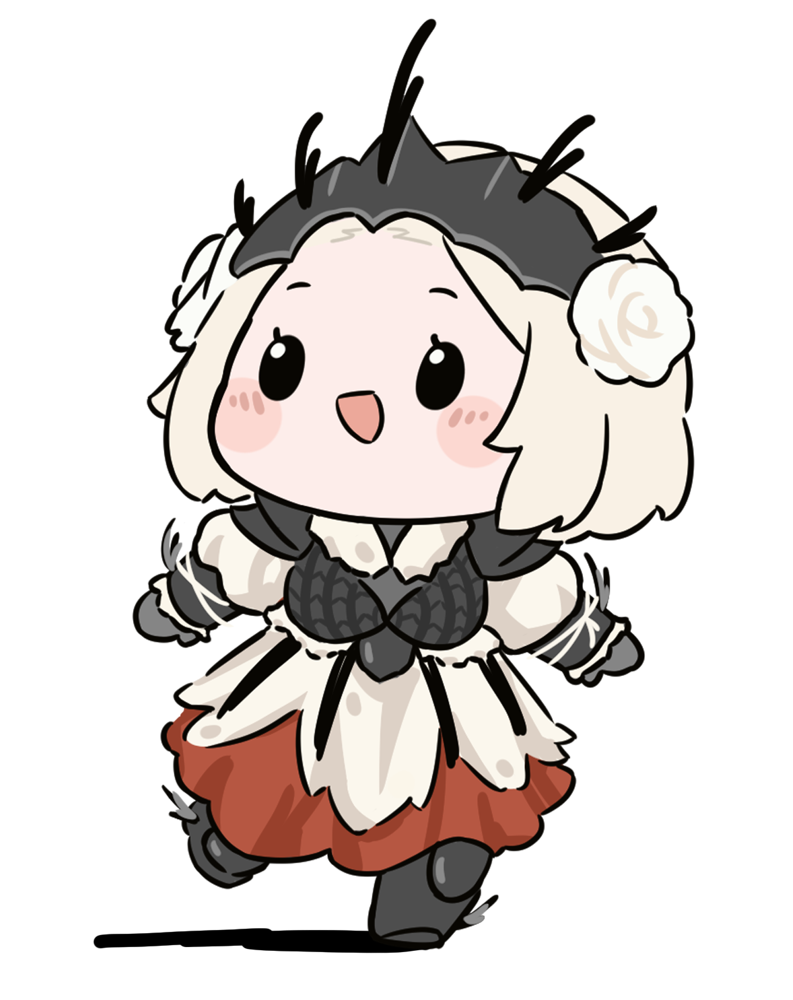
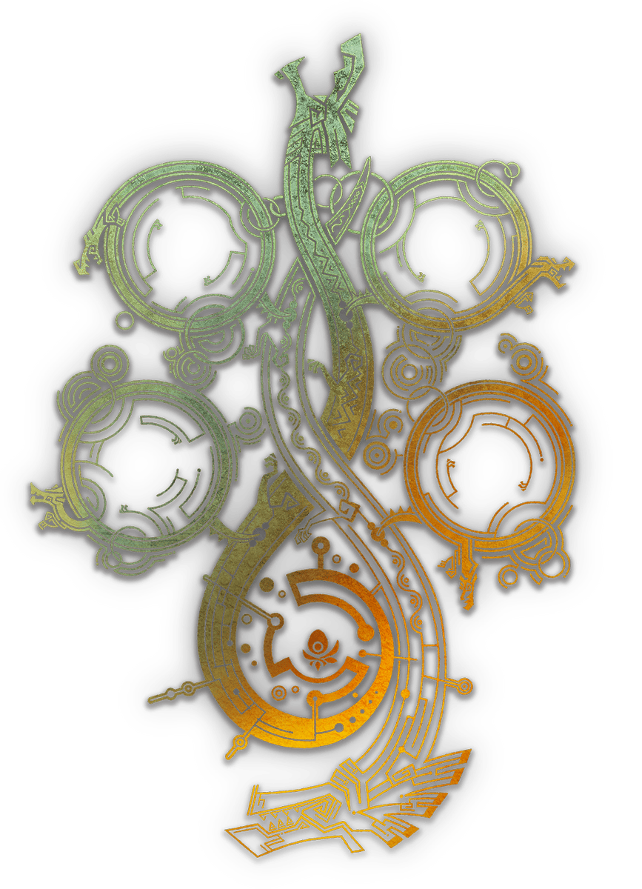
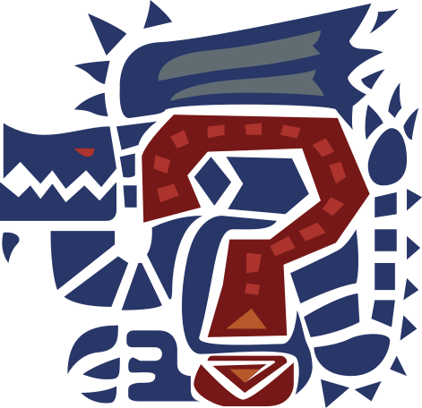

<div align="center">



# Kana's Body Framework

[](https://ko-fi.com/kana00)

## About

**Kana's Body Framework (KBF)** is a mod for *Monster Hunter Wilds* that lets you modify all the bones of important characters (Players, NPCs), and create, share, & organize presets for them.

This mod also serves as a very thorough native (C++) REFramework plugin reference, for which there is not much documentation within reframework itself, nor many open-source examples elsewhere.

Importantly, this mod also includes a hot-reloader for itself (`native/main_hot_reload.cpp`) which is absolutely necessary for making any native plugin of this complexity. Feel free to pillage this for your own plugins.

---

[]()
[]()

## Download 

<em>KBF Requires REFramework Nightly __01191__ (or higher)</em>

[]()
[](https://github.com/praydog/REFramework-nightly/releases)


## Installation

Extract the contents of the zip file into your game directory where `MonsterHunterWilds.exe` is located, or drop the zip into a mod manager of your choosing.

---

<p align="center">
  
</p>

## Building & Running

The recommended way to build KBF is with CMake & the MSVC compiler via Visual Studio.

</div>

#### 1. Pull The Repo & Submodules

This project uses Git submodules. First, clone the repository with submodules:
```bash
git clone --recurse-submodules https://github.com/kana-desu/KanasBodyFramework.git
```

If you already cloned the repo without `--recurse-submodules`, you can initialize and update them with:

```bash
git submodule update --init --recursive
```

---

#### 2. (Optional) Build and Use a Debug Build of REFramework

You can build an use a debug build of REFramework to assist when debugging. 

Run the following script with either `RelWithDebInfo` (Recommended, as below) or `Debug`.

```bash
cd external/reframework
git pull --recurse-submodules
git submodule update --init --recursive
mkdir build64_all
cd build64_all
cmake .. -G "Visual Studio 17 2022" -A x64 -DDEVELOPER_MODE=ON
cmake --build . --config RelWithDebInfo
cd ../../
```

This will generate the files `dinput8.dll` and `dinput8.pdb` in `external/reframework/build64_all/bin/MHWILDS`. 

Place them in your game directory to run REFramework as a debug build.

You can then attach to the process at run-time in Visual Studio via `Debug > Attach To Process...` / `Debug > Reattach to Process...` to catch any REFramework related errors.

---

#### 3. Build and load KBF

Firstly, make sure to set the plugin and hot-reload directories for the plugin in the configurations in `CMakeSettings.json`:

```bash
PLUGIN_HOT_RELOAD_DIR = <Game Directory>/reframework/data/KBF/HotReload
PLUGIN_OUTPUT_DIR     = <Game Directory>/reframework/plugins
```

This allows the plugin to be built straight to the correct directory without you having to move files around.

<br/>

This project includes two CMake targets: `KanaBodyFramework_Native.dll` and `KanaBodyFramework_Native_logic.dll`.

The former being the entry point to the plugin, and the latter being an (optional) hot-reloadable .dll holding the core part of the program.

<br/>

1. To build a release build (no hot-reloading), build the target `KanaBodyFramework_Native.dll` with the CMake Configuration `x64-Release-NoDB`.

2. To build a hot-reloadable debug build, build **both targets**: `KanaBodyFramework_Native.dll`, then `KanaBodyFramework_Native_logic.dll`, with the CMake Configuration `x64-Release`/`x64-Debug`.

<br/>

When building via `2.`, you can rebuild `KanaBodyFramework_Native_logic.dll` while the game is running and it will be automatically hot-reloaded to avoid having to restart your game.

---

<div align="center">

<p align="center">
  
</p>


## FAQ

</div>

<details>
<summary><b>❓ How do I _____ ?</b></summary>

Please refer to the various tutorials in the plugins UI in-game, under `About > Tutorials`.

</details>

<details>
<summary><b>✨ I'd like to suggest a feature!</b></summary>

Please [open an issue detailing your feature request](https://github.com/kana-desu/KanasBodyFramework/issues/new?template=feature_request.yml), or leave a comment on the mod's NexusMods page.

</details>

<details>
<summary><b>🐛 I found a bug! How do I report it?</b></summary>

Please [open an issue](https://github.com/kana-desu/KanasBodyFramework/issues/new?template=bug_report.yml) and include:  
- A clear description of the bug
- Whether the bug causes a game crash or just incorrect behavior
- Steps to reproduce it  
- Expected vs actual behavior  
- A copy of REFramework's `re2_framework_log.txt`
- A copy of KBF's debug log (under `Debug > Log > Copy to Clipboard`), if the game doesn't crash.

I have a limited amount of time to work on this mod and track down bugs, so without the above information I may not be able to address the issue!

</details>

<details>
<summary><b>🛠️ How can I contribute?</b></summary>

Contributions are very welcome given the scale of this plugin :)

You can:
- Fork the repo  
- Add new features or fix bugs  
- Submit a pull request  

I don't have a strict code style guide, but please try to keep your code clean and well-documented.

I'll need to be able to clearly review the changes myself so please try to keep them concise, easily understandable, and make sure to test them in-game (please try to avoid hard crashes!).

</details>

---

<div align="center">

## Known Issues & TODOs
</div>

<details>
<summary><b>Bugs / Known Issues</b></summary>

<br/>

<div align="center">

|  | Issue | Description | Severity |
|--------|-------|-------------|----------|
| ❌ | Missing Font Symbols | Some obscure font symbols are missing as they are not included is Noto CJK. | Med |
| ❌ | Bone Cache Overwrites | Some bone caches seem to write every load - like Cypurrpunk F-F | Med |
| ❌ | Fix certain cutscenes | In certain cutscenes, player and npc list appears to populate initially, then empty themselves as the cutscene begins | Low |

</div>

---
</details>

<details>
<summary><b>Potential Features</b></summary>

<br/>

<div align="center">


|  | Task | Description | Priority |
|--------|------|-------------|----------|
| ❌ | Randomizer | Select multiple presets to randomize between | Low |

</div>

---


</details>


</details>

<details>
<summary><b>Technical Enhancements</b></summary>

<br/>

<div align="center">


|  | Task | Description | Priority |
|--------|------|-------------|----------|
| ❌ | Simplify adding new NPC armours | Currently lots of code areas need to be changed. E.g. Name -> ID maps | High |
| ❌ | Remove unique_ptr arrays | Switch std unique_ptr containers to std optional / extra bool in struct for performance | Med |
| ❌ | Loading Screen Optimization | Optimize loading screen over fetching (especially for npcs) | Med |
| ❌ | Armour Fetch Optimization | Armour fetch can be quite slow: ~1-2ms . This may lead to frame drop spikes. | Med |
| ❌ | Test Quest End Cutscenes | These might break with TU3 | Low |

</div>

---

</details>

---

<div align="center">

[](http://creativecommons.org/licenses/by-nc-sa/4.0/)

</div>