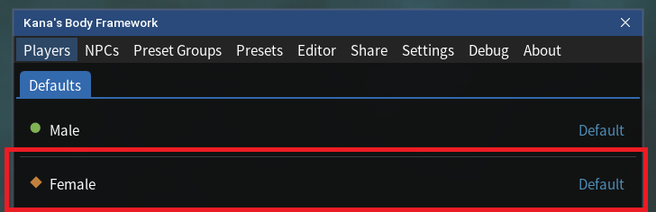

# Simple Setup Using Existing FBS Presets

## Overview

If you have used Female Body Sliders (FBS) previously, the simplest way to get started with Kana's Body Framework (KBF) is to migrate your existing FBS setup.

If you were also a user of my previous mod "Female Body Sliders for Everyone", these steps will get you the same setup as before, but now using KBF.

Note that if you change your presets within FBS, they will **not** automatically update, and you will have to follow these steps again.

---

<!-- TOC start (generated with https://github.com/derlin/bitdowntoc) -->

- [1. Import Existing FBS Presets as a Preset Bundle](#1-import-existing-fbs-presets-as-a-preset-bundle)
- [2. Create a Preset Group from the Imported Presets](#2-create-a-preset-group-from-the-imported-presets)
- [3. Assign the Preset Group to Female / Male Players](#3-assign-the-preset-group-to-female-male-players)

<!-- TOC end -->

---

<!-- TOC -->
## 1. Import Existing FBS Presets as a Preset Bundle

- Click "Import FBS Presets as Bundle" under the "Presets" tab. This will bring up a pop-up window:

- Enter a name for the set of presets under "Bundle Name".
- Click "Create". This will create a bundle of presets within KBF under the "Presets" tab:

---

<!-- TOC -->
## 2. Create a Preset Group from the Imported Presets

- Click "Create From Preset Bundle" under the "Preset Groups" tab. This will bring up a pop-up window:

- Enter a name for the preset group under "Name".
- Click the name of the previously imported preset bundle under the "Bundle" list.
- Click "Create". If a Warning window pops-up, click "Create Anyway":

- This will create a preset group within KBF under the "Preset Groups" tab:

<!-- TOC -->
## 3. Assign the Preset Group to Female / Male Players

- Click "Female" (and/or "Male") in the "Players" tab. This will bring up a pop-up window:

- Click on the name of the newly created preset group. 
- The name of the preset group should now appear next to "Female"/"Male" under the "Players" tab:

