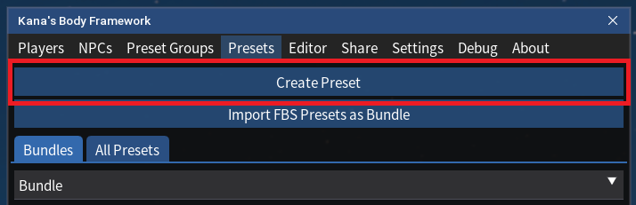
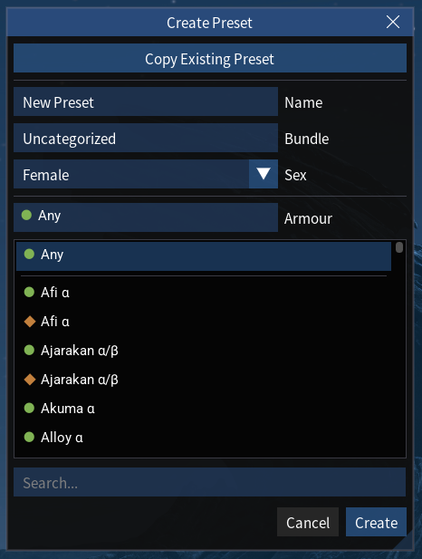
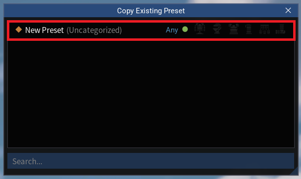

# Creating a Preset

# Overview

A preset in Kana's Body Framework (KBF) is a saved configuration of body sliders that can be applied to characters.

Creating your own presets allows you to customize character appearances and switch between different looks.

You can create presets in KBF in two ways:

<!-- TOC start (generated with https://github.com/derlin/bitdowntoc) -->

- [1. From Scratch](#1-from-scratch)
- [2. Copying an Existing Preset](#2-copying-an-existing-preset)

<!-- TOC end -->

---

<!-- TOC -->
## 1. From Scratch

- Click "Create Preset" under the "Presets" tab. This will bring up a pop-up window:

- Enter a name for your preset under "Name", 
- Enter a tag for the preset under "Bundle" (for organization).
- Select the intended sex characters using this preset under "Sex" (Not a hard restriction, just a label).
- Select the armour set from the list under "Armour".
	- This _will_ effect what bones can be edited later on. 
	- If you select "Any", only base-skeleton bones will be available for editing later.
- Click "Create". This will create a new preset within KBF under the respective Bundle in the "Presets" tab:

- This preset will be empty initially. To edit the preset, follow the steps in [Editing Bones](./3.%20Editing%20Bones.md).

---

<!-- TOC -->
## 2. Copying an Existing Preset

- Click "Create Preset" under the "Presets" tab. This will bring up a pop-up window:

- Click "Copy Existing Preset". This will bring up another pop-up window:

 

- Click the preset you want to copy from the list.
- Click "Create".