

# Creating a Preset Group

# Overview

A **preset group** in KBF is a collection of appearance settings (presets) that can be automatically applied to different character models / armour pieces.

Think of it as a smart organizer: you tell KBF which preset goes with which character model / armour pieces, and it takes care of applying the right one automatically.

Once you have a preset group, all you need to do is assign it to a character type (i.e. players, NPCs) for it to be used.

You can create preset groups in KBF in two ways:

1. From Scratch
2. By Copying an Existing Preset Group

---

<!-- TOC start (generated with https://github.com/derlin/bitdowntoc) -->

- [From Scratch](#from-scratch)
   * [1. Create the Preset Group](#1-create-the-preset-group)
   * [2. Assign Presets to Armour Pieces](#2-assign-presets-to-armour-pieces)
- [Copying an Existing Preset Group](#copying-an-existing-preset-group)

---

<!-- TOC end -->

<!-- TOC -->
# From Scratch

This section will guide you through creating an empty preset group, and applying presets to armour pieces within it.

<!-- TOC -->
## 1. Create the Preset Group

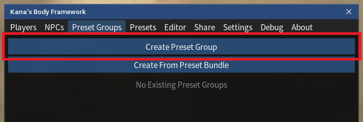

- Click "Create Preset Group" under the "Preset Groups" tab. This will bring up a pop-up window:

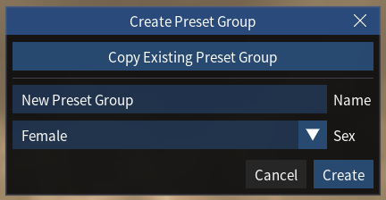

- Enter a name for your preset group under "Name", 
- Select the intended sex characters using this preset group under "Sex" (Not a hard restriction, just a label).
- Click "Create". This will create a new preset group within KBF in the "Presets Group" tab:

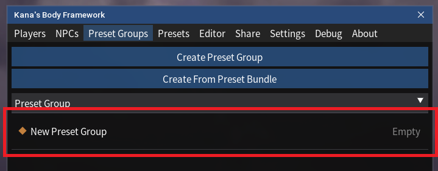

- This preset group will be empty initially, and you will need to assign presets to armour pieces within it.
 
---
<!-- TOC -->
## 2. Assign Presets to Armour Pieces

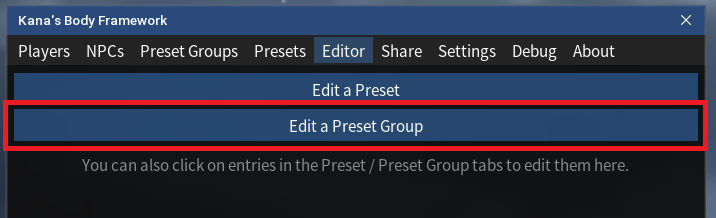

- Open the Preset Group you want to assign presets to in the "Editor" tab.

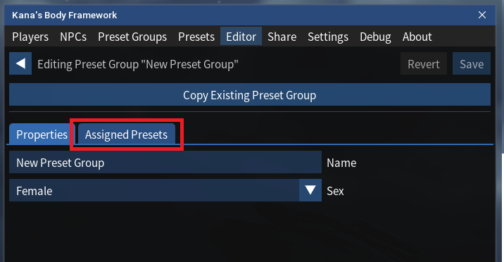

- Click "Assigned Presets". This will bing up a list of all armour sets in the game.

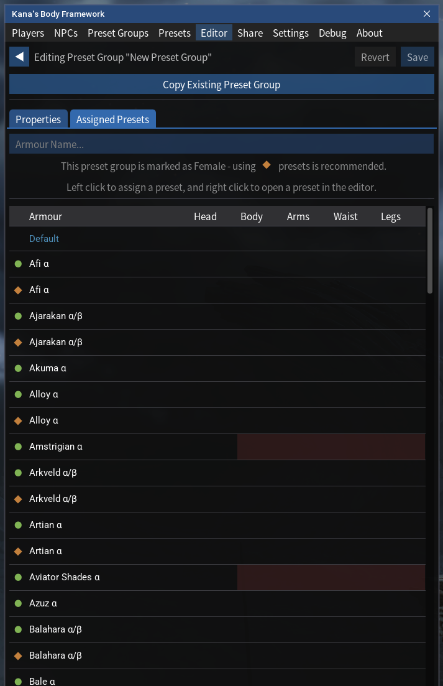

- _Note that red cells in this tabe signify that the armour set on the left does not have that speecific piece._

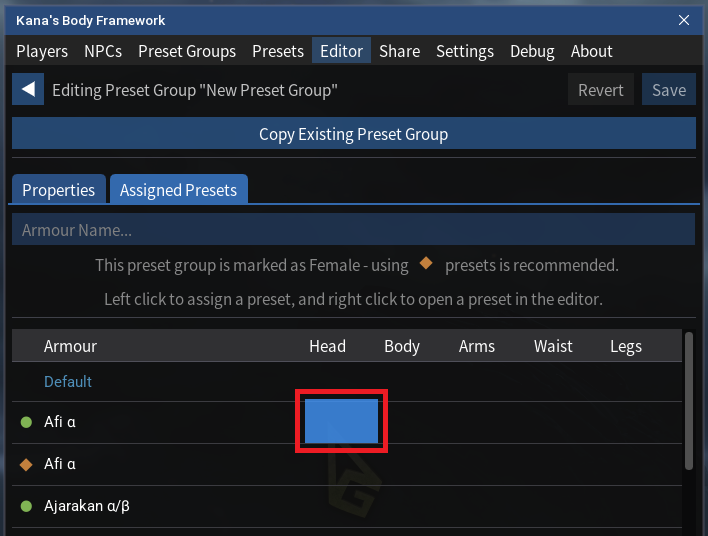

- To assign a preset to an armour piece, left click on the respective table entry (e.g. Afi Alpha, Head). This will bring up a pop-up window where you can select the preset to use.
- Once a preset is assigned, the respective table cell will turn green:

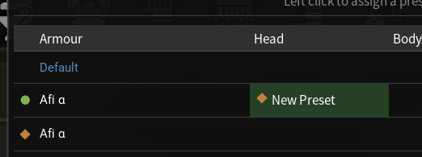

- If you want to remove a preset assignment, simply left click on the respective table entry again, and click "Default" in the pop-up window.
- Additionally, you can right click on a table entry to bring up a context menu which will allow you to quickly edit or create new presets in this slot:

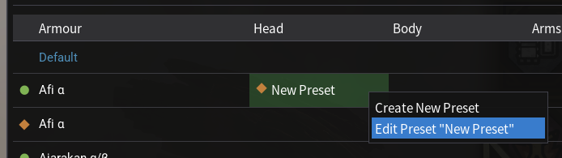

- Once you are happy with your preset assignments, click "Save" in the top right corner of the editor window to save your changes.

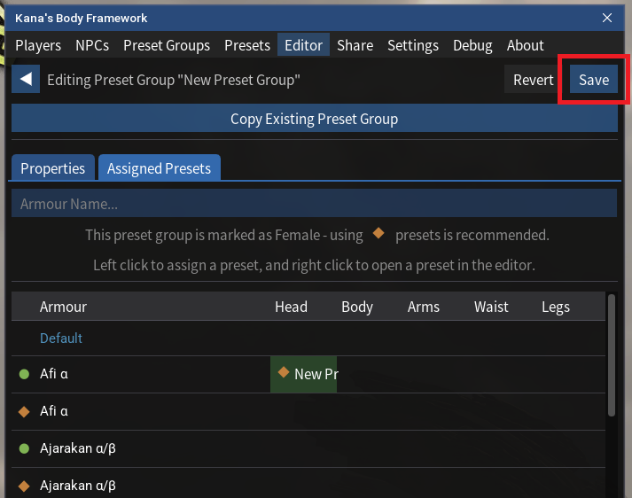

---

<!-- TOC -->
# Copying an Existing Preset Group

- Click "Create Preset" under the "Presets" tab. This will bring up a pop-up window:

- Click "Copy Existing Preset Group". This will bring up another pop-up window:

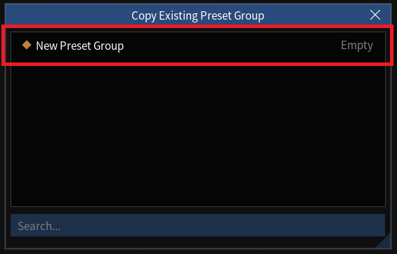

 

- Click the preset group you want to copy from the list.
- Click "Create".