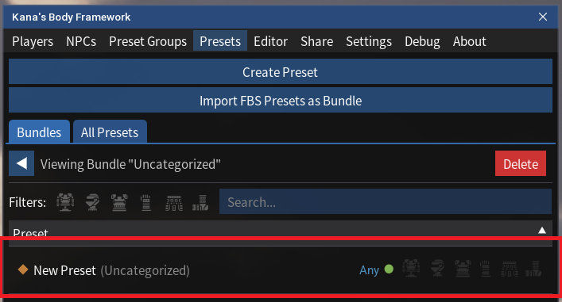
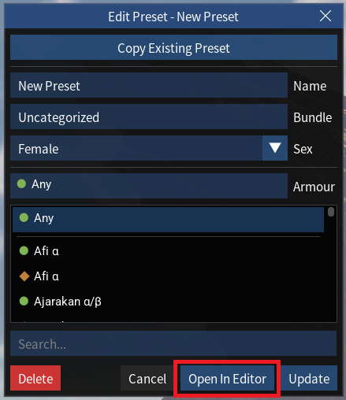
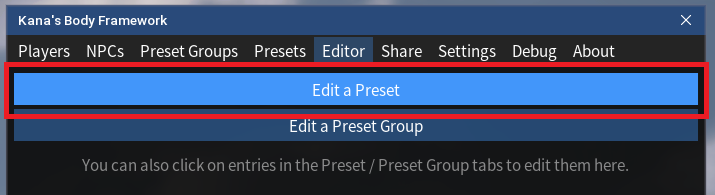

# TODO

<!--- ## 1. Open the Preset in the Editor

- Select the newly created preset from the list under the "Presets" tab. This will bring up a pop-up window:

- Click "Open In Editor". This will open the Preset in the Editor tab.

 

- _Alternatively_ click "Edit a Preset" under the "Editor" tab, and select the preset from the pop-up list.

--->