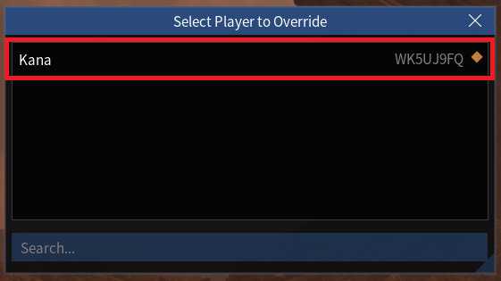
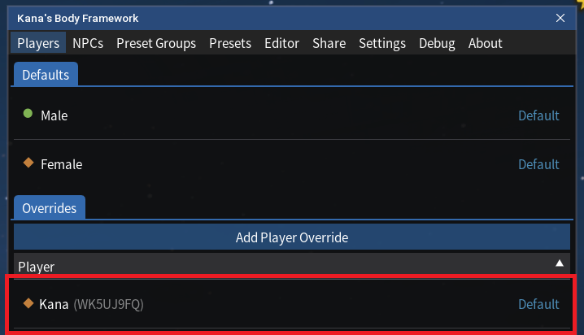
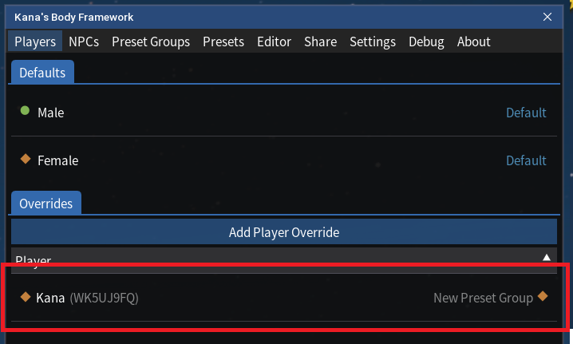

# Separately Modifying a Specific Player

# Overview

You may wish to modify the appearance of a specific player character separately from all other players.

For example if a friend has given you a set of presets that they usually apply to their character, you can set up KBF to only apply those presets to that specific character so that you can see their intended appearance.

This can be done by creating a _player override_ for that character and assigning a preset group to it.

---

## Steps

- Click "Add Player Override" under the "Players" tab. This will bring up a pop-up window:

- Select the player you want to modify separately from the list.  _Note that the desired player must be currently present in your game for them to appear in this list_.
- This will create a new Player Override for that character within KBF under the "Players" tab:

- Click the newly created Player Override under the "Players" tab. This will bring up a pop-up window:"

- Click the preset group that you want to assign only to this player under the "Preset Group" section.
- Click "Update". You should now see the preset group name appear on the right of the Player Override entry in the "Players" tab:

