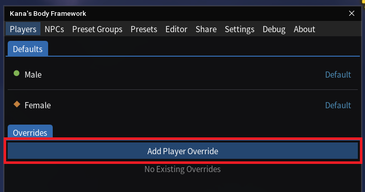
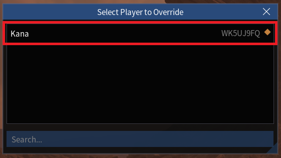
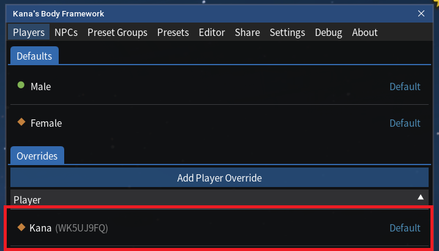
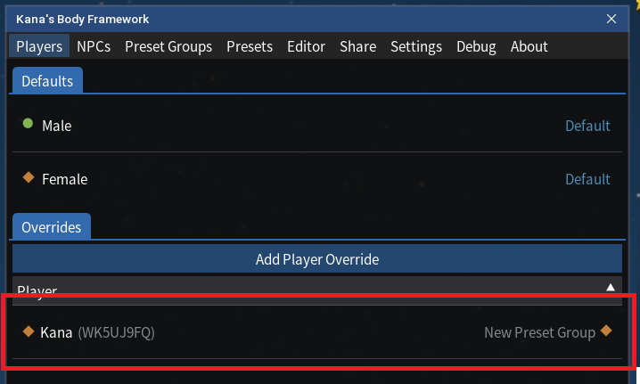
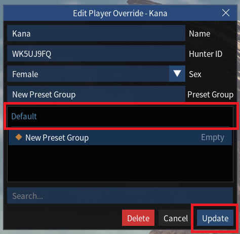

# Disabling Presets for Your Own Player Only

# Overview

You may wish to disable Kana's Body Framework (KBF) presets for your own player character if you want to continue using the Female Body Sliders (FBS) mod, etc.

This can be done by creating a player override for your player character which is set to 'default'.

---

<!-- TOC start (generated with https://github.com/derlin/bitdowntoc) -->

- [1. If you don't have an existing Player Override for your character](#1-if-you-dont-have-an-existing-player-override-for-your-character)
- [2. If you have an existing Player Override for your character](#2-if-you-have-an-existing-player-override-for-your-character)

<!-- TOC end -->

---

<!-- TOC -->
## 1. If you don't have an existing Player Override for your character

- Click "Add Player Override" under the "Players" tab. This will bring up a pop-up window:

- Click your character's name from the list.
- This will create a new Player Override for your character within KBF under the "Players" tab, shown with "Default" on the right:

---

<!-- TOC -->
## 2. If you have an existing Player Override for your character

- Click the existing Player Override for your character under the "Players" tab. This will bring up a pop-up window:

- Click "Default" under the "Preset Group" section.
- Click "Update".